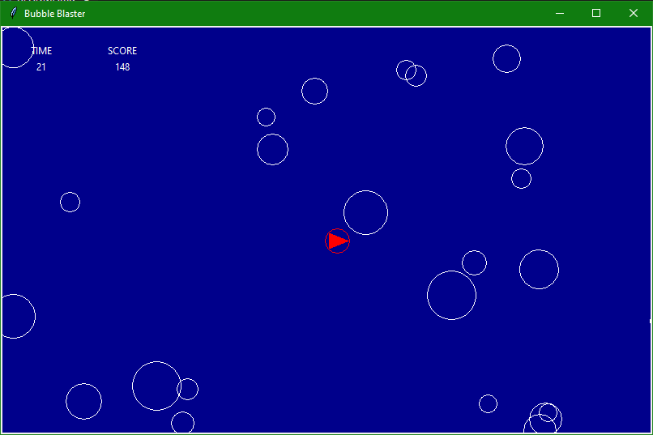
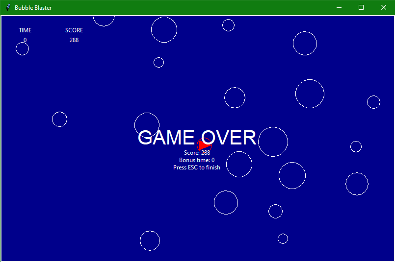

# Bubble blaster

## Overview

A simple arcade-like game in which you driver a ship into bubbles to increase your score and time left.

Create using python and the tkinter module.

## Instructions

- Arrow keys to move the ship
- Drive into bubbles to pop them
- Each popped bubble adds to your score and time left

## Screenshots

Game Start:

Game Finish:

